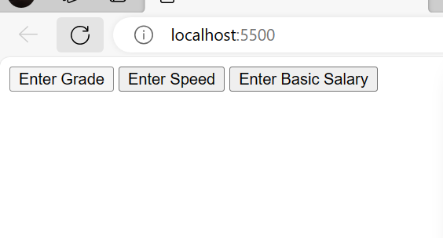
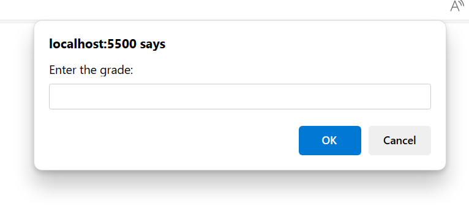

# Code Challenge Week-1

## Description
The challenge consists of three javascript files and a html file for testing if the codes work. The three JS codes consist of a net salary calculator that prompts the user to input a basic salary, calculates the taxes (NHIF,NSSF, and PAYE). It then outputs the net salary. The second Js file(speedDector), it prompts the user to input a speed in km/h, where if the driver is below a speed limit of 70, it prints out OK. Otherwise, after every 5km/h, it prints out points:1. If the speed is above 130km/h, the license is suspended. The third JS file genersates a students grade depending on the input the user inputs in the prompt, which only allows numeric input ranging from 0 to 100. The grades are graded as follows: A > 79, B - 60 to 79, C -  59 to 49, D - 40 to 49, E - less 40. The HTML file consists of what the user will see while filling the prompt.

# Author : Neuman Walala.

## Setup Installation and instruction

<ol>
<li>Clone the repository (Code-chalangeweek-) to a location in your file system.</li>
<li>Open the terminal you are using and navigate to the root folder and open it</li>
<li>Run `code .`</li>
<li>Open the index.html file and run it using the Go live command</li>
</ol>

# BDD

<ol>
<li>This here is the basic landing page</li>

<li>The user or admin can calculate every incidence depending on the requisition by typing in the prompt bellow</li>

<li>Remember that every button on the basic landing page is specific to the command</li>
</ol>

## Live Link: http://localhost:5500/

## Technology
<ol>
<li>This project was generated with the following:</li>
<li>Javascript</li>
<li>HTML</li>
</ol>

## Contact Information.
Your can get in touch with me on walalaneuman@gmail.com

## License
MIT License
<b>Copyright (c) 2023 Neuman-Nz<b>